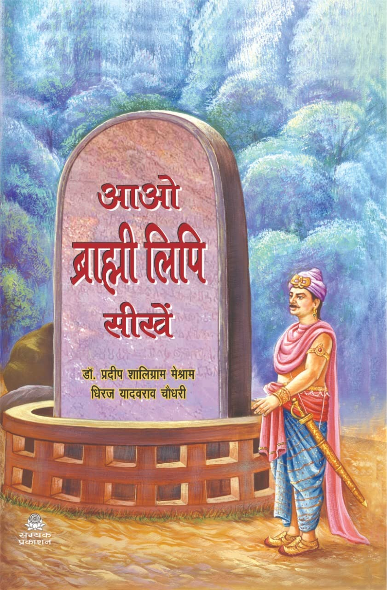
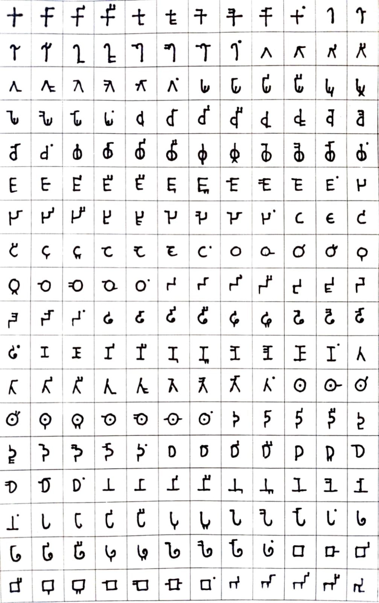
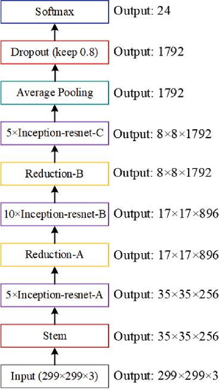
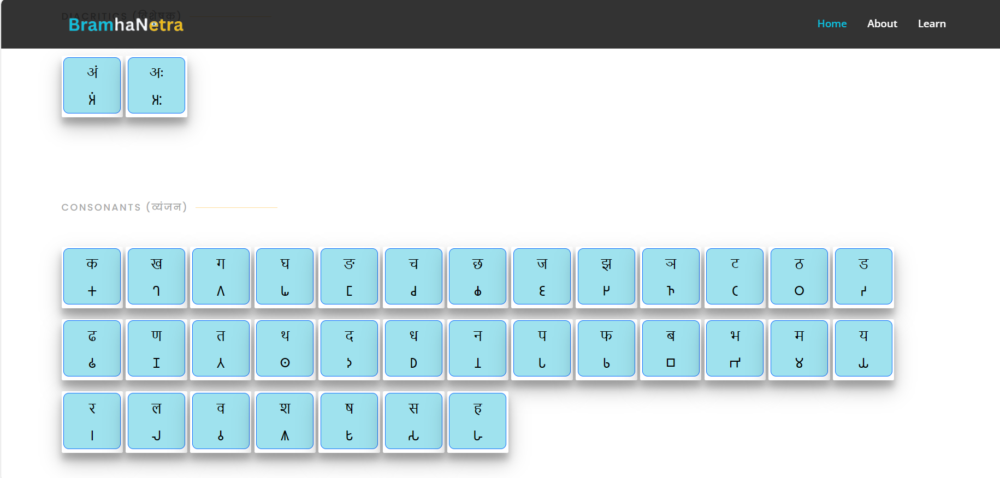

# BramhaNetra: Ancient Character Recognition (ACR)

BramhaNetra is an innovative project that focuses on Ancient Character Recognition (ACR), serving as a gateway to unraveling the rich tapestry of human history encoded within millennia-old manuscripts. The project employs a fusion of transfer learning, OpenCV, and convolutional neural networks (CNNs) to advance the frontiers of script decipherment and preservation.

## Table of Contents

- [Introduction](#introduction)
- [Installation](#installation)
- [Dataset](#dataset)
- [Model (InceptionResNetV2)](#model-inceptionresnetv2)
- [Implementation](#implementation)

## Introduction

The study and preservation of ancient scripts serve as vital conduits for understanding the rich tapestry of human history, culture, and language. Among the myriad scripts that have evolved over millennia, the Brahmi script stands as one of the oldest and most significant, serving as the foundation for numerous writing systems across South and Southeast Asia. In this project, we delve into the realm of Ancient Character Recognition (ACR) with a focus on the Brahmi script, employing a fusion of transfer learning, OpenCV, and convolutional neural networks (CNNs) to advance the frontiers of script decipherment and preservation.

## Installation

To install BramhaNetra, follow these steps:

1. Clone the repository:
   ```
   git clone https://github.com/tejaskolhe27/BramhaNetra.git
   ```
2. Install dependencies:
   ```
   pip install -r requirements.txt
   ```

## Dataset

Our dataset was manually created by writing on 18x12 grid paper. The reference for writing the dataset was taken from the book [AAO BRAHMI LIPI SIKHE](https://amzn.in/d/ewtohZ2) by Meshram, Dr. Pradip Shaligram, and Chaudhary, Dhiraj Yadavrav (2022), published by Samyak Prakashan. The dataset was meticulously crafted by transcribing the characters and symbols onto the grid paper, ensuring accuracy and consistency.



### Data Collection Method

The dataset was meticulously crafted by transcribing the characters and symbols onto the grid paper, ensuring accuracy and consistency.

#### Dataset Sample



## Model (InceptionResNetV2)

Inception-ResNet-v2 is a convolutional neural network that is trained on more than a million images from the ImageNet database. The network is 164 layers deep and can classify images into 1000 object categories, such as keyboard, mouse, pencil, and many animals.



1. **Inception Modules**:
   - Inception modules are fundamental to the InceptionResNetV2 architecture. These modules use multiple convolutional filters of different sizes (1x1, 3x3, 5x5) and pooling operations to capture features at different scales.
   - The idea behind Inception modules is to efficiently extract information at various levels of abstraction within the network.

2. **Residual Connections**:
   - InceptionResNetV2 incorporates residual connections, which are skip connections that allow the network to learn residual functions. This helps in training deeper networks by mitigating the vanishing gradient problem.
   - Residual connections enable the network to learn both low-level and high-level features effectively.

3. **Factorization into smaller convolutions**:
   - InceptionResNetV2 uses factorization techniques to reduce the computational complexity of convolutions. For example, it replaces a large convolutional layer with multiple smaller convolutions, which are computationally more efficient.

4. **Batch Normalization**:
   - Batch normalization is employed in InceptionResNetV2 to stabilize and accelerate the training process. It normalizes the activations of each layer, helping in faster convergence during training.

5. **Auxiliary Classifiers**:
   - In some versions of InceptionResNetV2, auxiliary classifiers are added at intermediate layers during training. These classifiers help in combating the vanishing gradient problem by providing additional gradients for earlier layers.

6. **Overall Architecture**:
   - InceptionResNetV2 typically consists of multiple Inception modules stacked together with residual connections between them.
   - The network architecture includes various layers such as convolutional layers, pooling layers, batch normalization layers, and fully connected layers (in the final classification part).

7. **Training and Applications**:
   - InceptionResNetV2 is often used for tasks like image classification, object detection, and image segmentation.
   - It is trained using large datasets like ImageNet and fine-tuned for specific tasks using transfer learning techniques.

## Implementation

After installation, you can use BramhaNetra by following these steps:

1. Navigate to the project directory:
   ```
   cd BramhaNetra
   ```
2. Run the object detection script:
   ```
   python app.py
   ```
3. Open GUI
   ```
   cd template
   google-chrome index.html
   ```
   *Note: You can also use other browsers instead of Chrome.*

#### Main Page


#### Learning Page 


